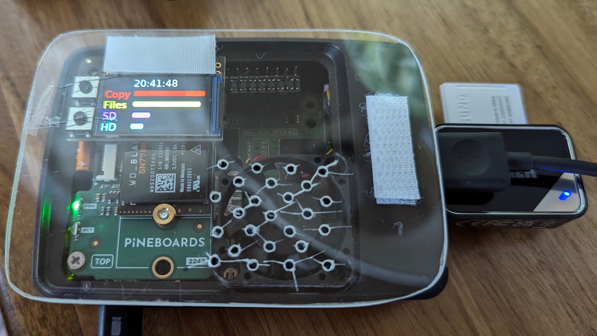

# gnarlypi

A simple replacement for the Gnarbox (RIP). 

This is to replicate some of the functions of that device, ideally to run on different iterations of the Raspberry PI and to have output displayed on a range of modules, LEDs and displays as I have them and develop the code.

Currently there is an alternative for the Gnarrbox doing the rounds on Kickstarter etc, this is the UnifyDrive UT2, earlybird price is 399 USD without any storage addded see [Kickstarter Campaign](https://www.kickstarter.com/projects/1945743381/ut2-redefining-portable-storage-solutions). A 2TB NVME drive is likely about 150 USD, so looking at 550 USD or possibly a lot more after launch.

This project then is to provide a _much_ cheaper alternative to that, though maybe without a nice box to put it in, and no battery either. But, we can create it with Raspberry PI's, storage and display options that fit in our budgets!

To be clear, my intention is to create a small low cost device, that I can use to backup my photos and videos while travelling and then when returning home, can copy those photos either onto my computer or my NAS for editing. Everything else is a bonus. 
I could carry a small laptop but I have enough weight in my bag with cameras/lenses, tablet etc and I also do not want to have to create an application that I can run on my phone/tablet to perform this function. TBH a pocket laptop like those created by GPD may be suitable if I could add 2TB of NVME storage to them but they are still pretty pricy as are the linux phones that are available.

## My Setup

I am developing this against a Raspberry PI 5, this has a [NVME NANO](https://thepihut.com/products/hatdrive-nano-for-raspberry-pi-5) along with a [WD Black 2TB SN770M   NVME drive 2230 M.2](https://www.amazon.co.uk/dp/B0CN17F7XC), its packed into the standard [Raspberry Pi 5 Case](https://thepihut.com/products/raspberry-pi-5-case), though this needed some modification to allow the fan to work. I did not use the [active cooler fan](https://thepihut.com/products/active-cooler-for-raspberry-pi-5), as there were some reports of this fan being sub-optimal in this case, though my construction may be even more sub-optimal! To read from SD an micro SD cards I use an [Anker 2-in-1 USB 3.0 SD Card Reader](https://www.amazon.co.uk/gp/product/B00LFIXC8I). 
Finally I Use [Right Angle USB C Male to Female Adapters](https://www.amazon.co.uk/dp/B0BLMSDYWD) to keep the power cable tidy.


That is my setup, could do with a nicer case and something stronger than the thin perspex I used for the cover

Depending on devices you connect, then [tall headers](https://thepihut.com/products/40-pin-extra-tall-header-push-fit-version-no-shroud) or [extra tall headers](https://thepihut.com/products/stacking-header-for-pi-a-b-pi-2-pi-3-2x20-extra-tall-header) may come in handy

I am using Raspberry PI OS lite (64bit) - so no GUI, this may change later to allow display on HDMI or similar screens

For the status output, I have the following and have tried to get them to work

- [ ] [Adafruit trinkey NeoPixel SAMD21 USB](https://thepihut.com/products/adafruit-neo-trinkey-samd21-usb-key-with-4-neopixels) - this would eb a super basic display _cannot get this to work with serial port_
- [ ] [blinkt](https://thepihut.com/products/blinkt) - basic LED only display, 8 LEDs. I've had this working but possibly my current blinkt! is broken
- [x] [Adafruit Mini PiTFT - 135x240 Color TFT](https://thepihut.com/products/adafruit-mini-pitft-135x240-color-tft-add-on-for-raspberry-pi-ada4393) - this is currently the preferred display for a pi zero 2W
- [x] [Adafruit Mini PiTFT - 240x240 Color TFT](https://thepihut.com/products/adafruit-mini-pitft-1-3-240x240-tft-add-on-for-raspberry-pi) - this is currently the preferred display

- [ ] [Waveshare 1.28" Round Touchscreen LCD Display](https://thepihut.com/products/1-28-round-touchscreen-lcd-display-module) - _cannot get this to work with 64 bit OS_

- [x] [LED shim](https://thepihut.com/products/led-shim) - basic LED only display, 24 LEDs


## System Design

The main code (gnarlypi) is to run at boot from cron, it will auto mount inserted SD cards (or cameras via USB) that appear to contain photos by having a **DCIM** directory at the top level of the device. 

My setup has an attached NVME drive which will hold the copied photos but the code will copy to the directory **usb_data** in the users home directory. You can mount any USB or NVME drive to this directory. This will be noted later in the installation instructions.

To allow many different types of output displays, output status will be published to MQTT topics, scripts will be provided to read from these topics and display the required output that the device can manage, allowing many/all of the devices to be running sided by side!
One other thing that intrepid users may want to consider is adding alternative status output devices, e.g use a text to speech synth to output via a speaker or headphones.

## Install the OS and configure

Head over to [Raspberry PI](https://www.raspberrypi.com/software/) and grab the Raspberry PI Imager. Choose your device, the OS (Raspberry PI OS lite) and edit your settings to enter your WiFi details, the hostname you want the device to use and the ssh credentials you wish to use.

Build your Raspberry PI, adding any required drives etc, I have some notes in [Hardware setup](docs/hardware_setup.md)


## Installing the gnarlypi software 

Hopefully this is the straight forwards bit, clone this repo onto your pi, into your home directory, then `cd` into the `gnarypi` directory and run the installer

```
./installer.sh
```

Hopefully that will do everything needed and the system will reboot and it will just work. Raise an issue on the repo if there are any problems and I will see if I can resolve them.

If you make any changes to the connected displays run the `display_config.sh` script to make changes.

## The code itself

The main code that controls things is written in Python, mostly because the majority of the devices you can buy and attach to your Raspberry Pi have Python libraries and I did not want to start from scratch. Also it was an opportunity to write some python and hopefully improve things.

I decided from the start to use a messaging system for the displays, this way I would not need to constantly fiddle with the main code, inserting ifs and buts for another display. Adding a new display mechanism is straight forwards and separate to the main code and can be tested  

## The software so far

- **be_gnarly** - this is called from cron and starts up all the required scripts to run the system
- **display_config.sh** - choose which of the display options you wish to use
- **gnarly_status_basic** - mostly for testing, displays MQTT messages in the terminal
- **gnarly_status_blinkt** - simple LED only status display 
- **gnarly_status_curses** - more advanced terminal display, needs work to tidy it up and stop screen flashes/tearing
- **gnarly_status_ledshim** - a longer simple LED only status display
- **gnarly_status_mini_pitft** - a compact 5 line 135x240 pixel display HAT, currently the nicest way to display status 
- **gnarly_status_pitft** - big sister to the mini above, a 240x240 pixel display HAT, currently the nicest way to display status - RECOMMENDED!
- **gnarlypi** - the main code, this does the copying
- **installer.sh** - the installer!
- _start_displays.sh_ - this script will be created by `display_config.sh` 
- **display_config.sh** - script to chose output displays, run as part of installer, creates _start_displays.sh_
- _tests/test_mini_pitft.py_**_ - test the the mini_pitft is working
- _test_status.py_ - test status displays by single step through a selection of MQTT messages

For extra testing, it is possible, by using [mqtt2jsonl](https://github.com/27escape/mqtt2jsonl), to record and replay the MQTT messages, in real-time, to simulate a complete copy of files from a USB to the storage device - very handy!


## Copying files from your camera

As mentioned above, I have a [Anker 2-in-1 USB 3.0 SD Card Reader](https://www.amazon.co.uk/gp/product/B00LFIXC8I) connected to my pi 5, this has standard and micro SD card slots, data should be read from this around 180MB/s depending on your SD card. It is possible to directly connect your camera via a USB cable (assuming it has USB) but the transfer rate is generally a lot lower, even when connected to USB3 ports, maybe around 25MB/s, so this should only be used in an emergency or when you have plenty of time or not may files to copy! :)

## Improvements / TODO

Interaction:
- allow limited button presses, only when not copying from SD, can still use some of the '/photo' topics to give status of actions
  - maybe 2 buttons as default, to give 3 interactions: A (as Yes), B (as No) and A+B (as C/Cancel/Back)
  - [ ] delete files from USB? Only allow if ONE connected device, to ensure correct choice - difficult for cameras with multiple card slots - user needs to remove each card, needs confirmation step
  - [ ] rsync to NAS/computer - target defined in some config file, check target available before attempt 

During copy process:
- extract image thumbnails for 
- [ ] Create day/trip indexes to each file that can be accessed via Samba/smb shares
  - Create folder for each day/trip with symlinks to the relevant images
  - a complete re-index script, inc thumbnail extraction

Management: 
- [ ] Create web app for management
  - [ ] view/delete images or block wipe
  - [ ] investigate photo album software
- [ ] investigate creating WiFi network, when away from home

Getting files off device:
- [ ] investigate USB Gadget mode for Pi Zero 2
  - allows personal devices to connect to samba/photo album for edit/sharing images
- [ ] Use buttons to trigger copying to NAS

Device improvements:
- [ ] power button for non PI 5 devices
  - For devices that do not provide an off switch (nice shutdown), we will need to investigate options to replicate that, either with buttons provided by any display choice or by adding our own switch, this is especially important for the PI's without a power button, check out https://howchoo.com/pi/how-to-add-a-power-button-to-your-raspberry-pi/ for a solution to that issue 
  - the [OnOff SHIM](https://thepihut.com/products/onoff-shim) _may_ be a solution but button placement is not ideal, a secondary button will need soldering, intial trials show it may conflict with the adafruit PiTFT displays

- [ ] CFexpress? My cameras don't use these cards, so this would only be added if anyone else needs it, ideally its just another USB device and should read and copy fine, without any code changes


Alternative all in one solutions:

There are interesting things over at [ClockworkPi](https://www.clockworkpi.com/shop) that seem to be based on the CM4 compute modules, which would mean external USB for storage, but that could be fine and things do not have to be super fast :)

Would the [Zero Terminal](https://n-o-d-e.net/zeroterminal3.html) be a nice all in one device? _It does not look like this has had development in years and I cannot figure out how to contact the developer_

For the PI 5, the [KKSB 7" display case](https://thepihut.com/products/kksb-case-for-raspberry-pi-5-and-the-official-raspberry-pi-7-touchscreen) could be a nice but I would need to create the web app to provide display and control features.

Little Bird Electronics used to have a nice [PI 3 display/keyboard combo](https://littlebirdelectronics.com.au/products/raspberry-pi-3-2b-zero-mini-portable-2-4ghz-wireless-touchpad-keyboard-with-backlight) _but it is no longer available_

Something like the [Micro Journal rev 2](https://liliputing.com/micro-journal-rev-2-revamp-is-a-compact-word-processor-with-a-mechanical-keyboard-and-a-clamshell-design/) could work _but needs storage and SD card capabilities_

[Planet Computers](https://www.www3.planetcom.co.uk/) may have a suitable device but would need to a USB hub to have bigger external storage. The Gemini and Cosmo models are kinda at the top end of the price range for what I am trying to achieve. _Not sure if they are still in operation_
