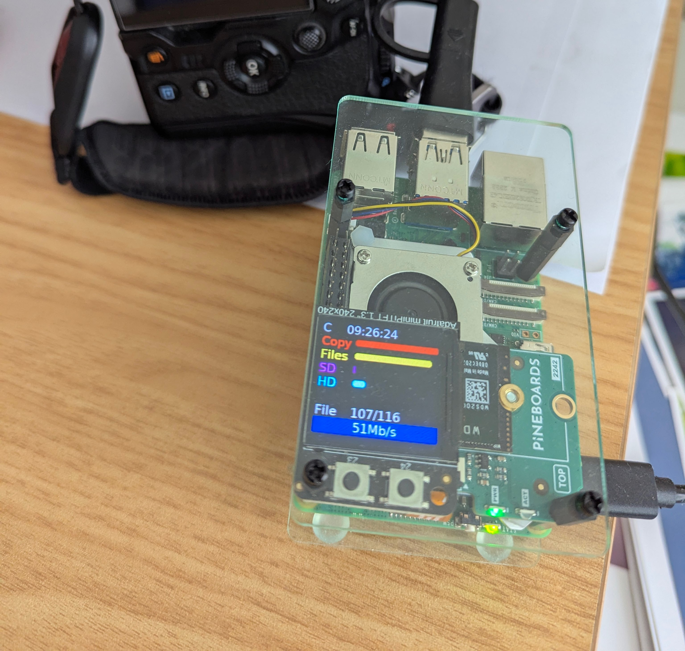

# gnarlypi

A simple replacement for the Gnarbox (RIP). 

This is to replicate some of the functions of that device, ideally to run on different iterations of the Raspberry PI and to have output displayed on a range of modules, LEDs and displays as I have them and develop the code.

Currently there is an alternative for the [Gnarrbox 2.0](https://www.kickstarter.com/projects/gnarbox/gnarbox-20-ssd-rugged-backup-device-for-your-camer?ref=discovery&term=camera%20backup&total_hits=13&category_id=333) doing the rounds on Kickstarter etc, this is the UnifyDrive UT2, earlybird price is 399 USD without any storage addded see [UnifyDrive UT2 - Kickstarter](https://www.kickstarter.com/projects/1945743381/ut2-redefining-portable-storage-solutions). A 2TB NVME drive is likely about 150 USD, so looking at 550 USD or possibly a lot more after launch. Other alternative devices can be found in [docs/alternatives](./docs/alternatives.md)

This project then is to provide a _much_ cheaper alternative to that, though maybe without a nice box to put it in, and no battery either. But, we can create it with Raspberry PI's, storage and display options that fit in our budgets!

To be clear, my intention is to create a small low cost device, that I can use to backup my photos and videos while travelling and then when returning home, can copy those photos either onto my computer or my NAS for editing. Everything else is a bonus. 

I could carry a small laptop but I have enough weight in my bag with cameras/lenses, tablet etc and I also do not want to have to create an application that I can run on my phone/tablet to perform this function. TBH a pocket laptop like those created by GPD may be suitable if I could add 2TB of NVME storage to them but they are still pretty pricy as are the linux phones that are available.

## My Setup

I am developing this against a Raspberry PI 5, this has a [NVME NANO](https://thepihut.com/products/hatdrive-nano-for-raspberry-pi-5) along with a [WD Black 2TB SN770M   NVME drive 2230 M.2](https://www.amazon.co.uk/dp/B0CN17F7XC), its packed into the standard [Raspberry Pi 5 Case](https://thepihut.com/products/raspberry-pi-5-case), though this needed some modification to allow the fan to work. I did not use the [active cooler fan](https://thepihut.com/products/active-cooler-for-raspberry-pi-5), as there were some reports of this fan being sub-optimal in this case, though my construction may be even more sub-optimal! To read from SD an micro SD cards I use an [Anker 2-in-1 USB 3.0 SD Card Reader](https://www.amazon.co.uk/gp/product/B00LFIXC8I). 
Finally I Use [Right Angle USB C Male to Female Adapters](https://www.amazon.co.uk/dp/B0BLMSDYWD) to keep the power cable tidy.


That is my setup, now with a nicer case, reading direct from my camera.

Depending on devices you connect, then [tall headers](https://thepihut.com/products/40-pin-extra-tall-header-push-fit-version-no-shroud) or [extra tall headers](https://thepihut.com/products/stacking-header-for-pi-a-b-pi-2-pi-3-2x20-extra-tall-header) may come in handy

I am using Raspberry PI OS lite (64bit) - so no GUI, this may change later to allow display on HDMI or similar screens

For the status output, I have the following and have tried to get them to work

- [ ] [Adafruit trinkey NeoPixel SAMD21 USB](https://thepihut.com/products/adafruit-neo-trinkey-samd21-usb-key-with-4-neopixels) - this would eb a super basic display _cannot get this to work with serial port_
- [ ] [blinkt](https://thepihut.com/products/blinkt) - basic LED only display, 8 LEDs. I've had this working but possibly my current blinkt! is broken
- [x] [Adafruit Mini PiTFT - 135x240 Color TFT](https://thepihut.com/products/adafruit-mini-pitft-135x240-color-tft-add-on-for-raspberry-pi-ada4393) - this is currently the preferred display for a pi zero 2W
- [x] [Adafruit Mini PiTFT - 240x240 Color TFT](https://thepihut.com/products/adafruit-mini-pitft-1-3-240x240-tft-add-on-for-raspberry-pi) - this is currently the preferred display

- [ ] [Waveshare 1.28" Round Touchscreen LCD Display](https://thepihut.com/products/1-28-round-touchscreen-lcd-display-module) - _cannot get this to work with 64 bit OS_

- [x] [LED shim](https://thepihut.com/products/led-shim) - basic LED only display, 24 LEDs


## System Design

The main code (gnarlypi) is to run at boot from cron, it will auto mount inserted SD cards (or cameras via USB) that appear to contain photos by having a **DCIM** directory at the top level of the device. 

My setup has an attached NVME drive which will hold the copied photos but the code will copy to the directory **usb_data** in the users home directory. You can mount any USB or NVME drive to this directory. This will be noted later in the installation instructions.

To allow many different types of output displays, output status will be published to MQTT topics, scripts will be provided to read from these topics and display the required output that the device can manage, allowing many/all of the devices to be running sided by side!
One other thing that intrepid users may want to consider is adding alternative status output devices, e.g use a text to speech synth to output via a speaker or headphones.

See [[the_software]] for more details

## Install the OS and configure

Head over to [Raspberry PI](https://www.raspberrypi.com/software/) and grab the Raspberry PI Imager. Choose your device, the OS (Raspberry PI OS lite) and edit your settings to enter your WiFi details, the hostname you want the device to use and the ssh credentials you wish to use.

Build your Raspberry PI, adding any required drives etc, I have some notes in [Hardware setup](docs/hardware_setup.md)


## Installing the gnarlypi software 

Hopefully this is the straight forwards bit, clone this repo onto your pi, into your home directory, then `cd` into the `gnarypi` directory and run the installer

```
./installer.sh
```

You will be prompted to enter a password (twice), this is for the SAMBA file sharing and is for the name of the user you are currently logged in as. Please remember this password!

Hopefully that will do everything needed and the system will reboot and it will just work. Raise an issue on the repo if there are any problems and I will see if I can resolve them.

## Using the system

Rebooting the system when it has been installed, will have the system up and running. 

Then either connect a camera (in storage mode) via USB or a suitable SD Card reader, such as the [Anker 2-in-1 USB 3.0 SD Card Reader](https://www.amazon.co.uk/gp/product/B00LFIXC8I) which also has micro SD card slots, using an SD card read is MUCH faster than connecting to a camera directly.

Do not connect your camera or insert your SD card until the system has booted up, otherwise the system will consider that drive as part of the system and will ignore it. If this happens, just remove and reboot!

Copying will start automatically when a suitable card/device is connected, the display(s) will show the status until the copy is complete. You will then be prompted to remove the card and the system will return to waiting for another device to be connected.

If connecting a camera that has multiple card slots, then all of these will be read and processed before the remove message is displayed.

### Copy speeds

On a Raspberry Pi 5, data should be read from a USB3 connected SD card reader around 180MB/s to 200MB/s depending on your SD card (assuming copying to NVME storage) and via a USB cable to a camera at about 25MB/s, so set aside plenty of time to copy! :)

On the Raspberry Pi Zero, its much slower, I get 12MB/s via USB2 SD card reader to a USB2 connected drive and USB2 to a connected to camera its about 11MB/s, so no advantage there, this may allow a future iteration based on the pi Zero not to require a SD card interface and hence be a bit cheaper still.

### Retrieving files

The system uses SAMBA to provide file sharing, allowing you to retrieve previously stored files. On your home network, you should be able to connect to using the host name of the system you created when building the system

I have not given much thought to documenting this step but you will need to connect as a registered user, with the username of your raspberrypi and the password you created during installation.

- Windows - [How to connect to Linux Samba shares from Windows](https://www.supportyourtech.com/articles/how-to-connect-to-smb-share-windows-11-a-step-by-step-guide/)
- Mac/OSX [How to Connect Your macOS Device to an SMB Share](https://www.techrepublic.com/article/how-to-connect-your-macos-device-to-an-smb-share/)
- Linux - given the range of options for file managers etc, I am not going to provide a link, you are competent enough to search the internet yourself 

## Configuring the system

see [[docs/config]]

## TODO

see [[docs/TODO]]
